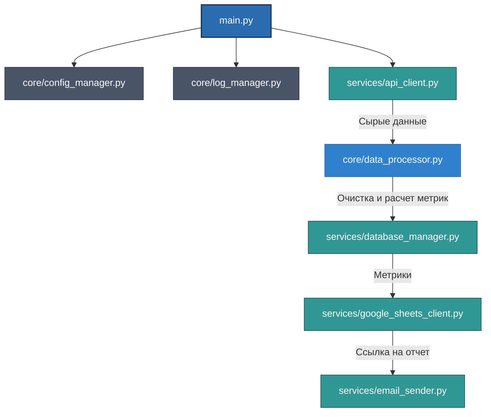

# Data Processing Pipeline

Проект для автоматической обработки данных из API, сохранения в базу данных PostgreSQL, расчета метрик, загрузки результатов в Google Sheets и отправки отчетов по email.

## 📁 Структура проекта

<pre>
data-processing-pipeline/
├── assets/
│   ├── console_logs.png
│   ├── email_report.png
│   └── sheets_dashboard.png
├── core/
│   ├── __init__.py
│   ├── config_manager.py
│   ├── data_processor.py
│   └── log_manager.py
├── services/
│   ├── __init__.py
│   ├── api_client.py
│   ├── database_manager.py
│   ├── email_sender.py
│   └── google_sheets_client.py
├── config.ini.example
├── main.py
├── README.md
└── requirements.txt
</pre>

## ⚙️ Функциональность

✅ **Получение данных** через REST API  
✅ **Обработка и преобразование** данных с учетом отсутствующих значений  
✅ **Сохранение** в базу данных PostgreSQL  
✅ **Расчет метрик** (уникальные пользователи, типы попыток, успешные попытки)  
✅ **Экспорт результатов** в Google Sheets  
✅ **Автоматическая отправка** отчетов по email  
✅ **Логирование** с очисткой старых логов  
✅ **Обработка ошибок** на всех этапах 

## Архитектурная схема взаимодействия (Mermaid)



    
## Скриншоты и макеты отчетов

1. [Скриншот 1: Google Sheets Дашборд](assets/sheets_dashboard.png)
2. [Скриншот 2: Входящее e-mail уведомление](assets/email_report.png)
3. [Скриншот 3: Логи работы в консоли](assets/console_logs.png)


## 🚀 Быстрый старт

### 1. Клонирование репозитория
```bash
git clone https://github.com/VadbOss/portfolio.git
cd portfolio/data-processing-pipeline

## Настройка

1. Скопируйте `config.ini.example` в `config.ini` и заполните настройки.
2. Установите зависимости: `pip install -r requirements.txt`
3. Запустите: `python main.py`

